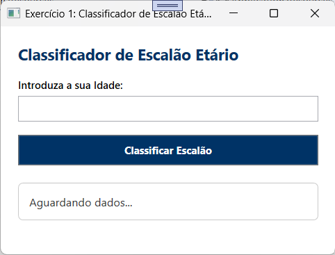
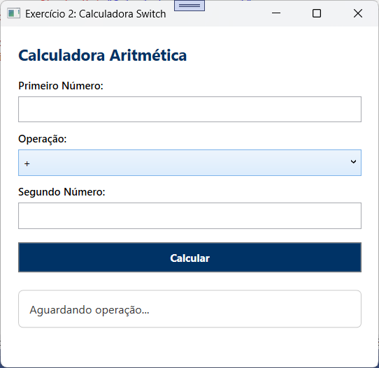
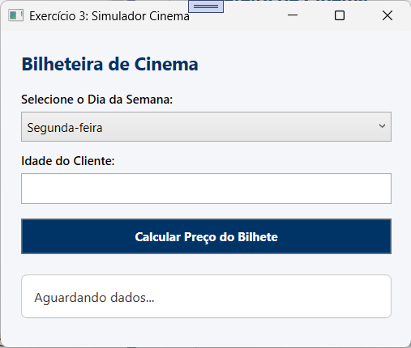

# ValidadorDecisaoWPF

Neste laboratório, vamos construir uma janela WPF que avalia o desempenho de um aluno e aplica descontos na propina com base na categoria selecionada (refatoriação de um exercício feito anteriormente em C).

## Exercício 1: Classificador de escalão etário
No mesmo projeto, criar uma nova janela WPF onde o utilizador introduz a sua idade num TextBox. Utilizar a estrutura if / else if / else para determinar o escalão:
• Menor de 12 anos: Escalão Infantil
• Entre 12 e 17 anos: Escalão Juvenil
• Entre 18 e 64 anos: Escalão Adulto
• 65 ou mais anos: Escalão Sénior
Exibir a mensagem correspondente num TextBlock com aviso se a idade for inválida (<= 0).

## Exercício 2: Calculadora aritmética com seleção por Switch
Criar uma nova janela com dois TextBox para números e uma ComboBox com as opções (+, -, *, /).
Ao clicar num botão 'Calcular', utilizar a instrução switch para executar a operação selecionada. Lembrar de validar a divisão por zero (ex.: se o segundo número for 0 na divisão, exibir uma mensagem de erro preventiva).

## Exercício 3 (Desafio de Extensão): Simulador de Preço de Bilhete de Cinema
Criar um formulário para venda de bilhetes de cinema com base no dia da semana (ComboBox) e idade do cliente (TextBox).
• Preço Base: 7.50 €
• Terça-feira (Dia do Espetador): Desconto fixo de 2.00 €
• Estudantes/Seniores (<= 18 ou >= 65 anos): Desconto adicional de 1.50 €
Combinar estruturas if e switch para calcular o preço final do bilhete e exibir o resumo detalhado.

